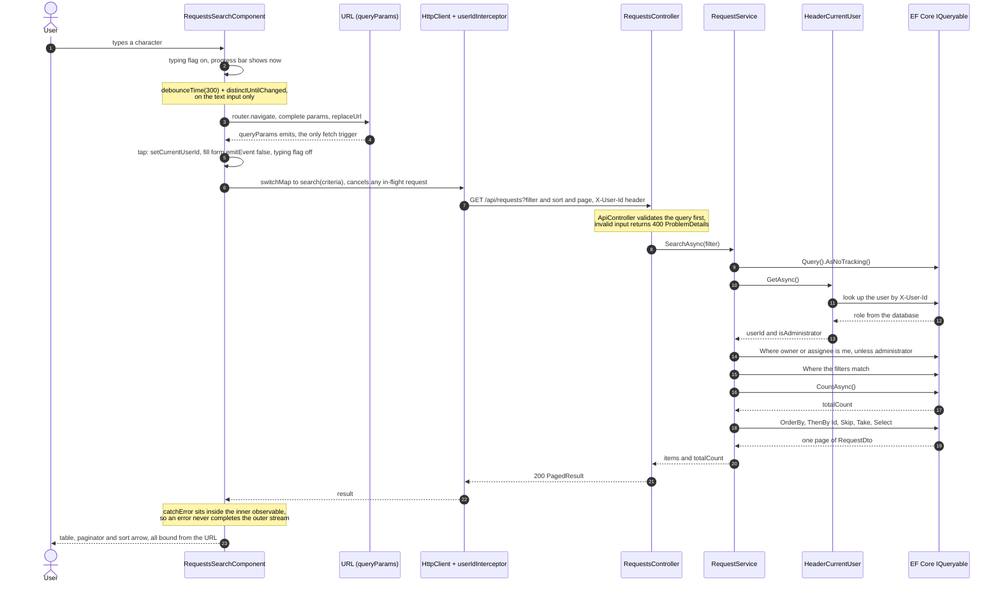

# Requests — Search & Filter

Search, filtering, sorting and paging over a Requests list, with server-enforced
permissions. Backend: .NET 8 / ASP.NET Core / EF Core. Frontend: Angular.

The feature is complete end to end. One defect was found, measured and fixed, and
the remaining gaps are listed under [What was not completed](#what-was-not-completed).

This repository is Part A. Part B, the architecture design, is submitted
separately as a PDF.

---

## Running it

### Quick start

```
.\run.cmd     # starts both servers, prints the URL once they answer
.\stop.cmd    # stops them
```

The first run also installs the client dependencies, which takes a few minutes.

The manual commands below do the same thing on any platform.

### Backend

```bash
dotnet restore
dotnet run --project src/Requests.Api
```

| | |
|---|---|
| HTTP | `http://localhost:60702` |
| HTTPS | `https://localhost:60701` |
| Swagger | `https://localhost:60701/swagger` |

The Angular dev server proxies `/api` to the HTTP port, so both must be running to use
the app. The database is in-memory and seeded on startup — no setup, no connection
string. Identity is registered only under `Development`; the API throws at startup in
any other environment.

### Frontend

Angular **19.2.25** (CLI 19.2.27) with Angular Material **19.2.19**.

```bash
cd client
npm install
npm start
```

App: `http://localhost:4200`

### Identity

There is no login. The calling user is supplied by an `X-User-Id` header, sent
automatically by an Angular interceptor; a switcher in the UI changes it so both
permission paths can be demonstrated.

| User ID | Name | Role |
|---|---|---|
| 1 | Dana Levi | Standard |
| 2 | Noa Cohen | Standard |
| 3 | Yossi Mizrahi | Standard |
| 4 | Amit Bar | Standard |
| 5 | Tal Shapira | Standard |
| 99 | System Administrator | Administrator |

The 500 seeded requests reference owner and assignee ids in the range 1–5, so every
standard user sees a different, overlapping subset. User 1 sees 186 of the 500; the
administrator sees all 500.

### Tests

```bash
dotnet test
```

**Stop the API first** (`.\stop.cmd`). `dotnet test` builds the solution, and a running
`Requests.Api.exe` holds a file lock on `Requests.Application.dll` and its siblings. If
anything needs rebuilding, the copy into `src/Requests.Api/bin` fails with `MSB3021:
Unable to copy file ... because it is being used by another process` before a single test
runs. When everything is already built the copy is skipped and it passes, so this is an
intermittent trap rather than a reliable one — which is the worse kind.

16 tests, all passing. Two are unit tests over `RequestService` with a real
`DbContext` — the permission boundary for a standard user and for an administrator.
The rest are integration tests through `WebApplicationFactory`, against the real host
and the seeded data, because the failure worth guarding against is a filter that
quietly never reaches the query, and a mocked repository cannot catch that:

| What it pins | |
|---|---|
| A standard user sees only rows they own or are assigned, **and `totalCount` counts only those** | The count assertion is the point: it fails if the permission filter is applied after `CountAsync` |
| An administrator sees every seeded request | And is served at least one row the standard user is denied |
| `status` and a date range combine, and the whole of the final day is included | Pins `CreatedAt < toDate.AddDays(1)` rather than an exclusive instant |
| Every invalid input in the contract's error table returns `400` with `ProblemDetails` | One `[Theory]`, six cases: unknown enum, `sortBy` outside the allow-list, `pageSize` over the ceiling, `page` below 1, `page` above the ceiling, `fromDate` after `toDate` |
| Every identity failure returns `401` | One `[Theory]`, four cases. The missing-header case matters most: it pins that no identity is rejected rather than silently becoming user 1 |
| Page 1 and page 2 together equal a single 50-row read | `Skip`/`Take` is exact — nothing repeated at the boundary, nothing dropped |

**What the paging test does not cover.** It pins that `Skip`/`Take` is exact. It does
**not** pin the `.ThenBy(r => r.Id)` tie-breaker: removing that line leaves the whole
suite green, because EF Core InMemory executes `OrderBy` as a LINQ-to-Objects sort,
which is stable, so tied rows keep insertion order either way. The instability the
tie-breaker guards against belongs to real database engines, where the order among tied
rows is unspecified. Catching it would need a provider that reorders ties.

The other cases were checked the same way and do have teeth: moving the permission
filter after `CountAsync`, and treating `toDate` as an exclusive instant, each made
exactly the matching test fail.

---

## Technology choices

**Kept the starter's stack and architecture** — .NET 8, four-layer Clean
Architecture, EF Core. The dependency direction is correct and the separation is
clean; there was nothing to fix at the architectural level. The real defect was in
the data layer: `RequestRepository.GetAllAsync` materialised the entire table into
memory before filtering. Against the stated assumption of millions of rows, that is
the flaw the exercise is testing, and that is where the work went.

Rewriting to Vertical Slice, or adding CQRS/MediatR for a single read feature, would
have consumed hours without serving any requirement — and the brief explicitly
prefers a simple, well-reasoned solution over unnecessary complexity.

**Angular** for the frontend, matching the role.

**Angular Material for the UI** — the search screen is built from `MatTable`, `MatSort`,
`MatPaginator`, `MatDatepicker` and `MatSelect`. Every structure the brief asks for — a
sortable header, a paginator, a date range, a multi-select — exists as a component, so the
time went into behaviour rather than into markup and CSS, and keyboard support and ARIA
came with the components instead of being written by hand. For a .NET + Angular codebase
this is the unremarkable choice; what would need explaining is a deviation from it.

**The components emit events; they do not hold state.** This is the part worth reading.
`MatTableDataSource` is deliberately *not* wired to `MatSort` or `MatPaginator`. Those
built-in connections sort and paginate the array already in memory — which here means
sorting the 25 rows of the current page out of several thousand, and returning a wrong
answer that looks entirely correct. Sorting and paging are server-side, so `MatSort` and
`MatPaginator` are used purely as UI event sources: their inputs are bound from the URL,
and their outputs trigger a navigation. `MatPaginator` counts from 0 while the API counts
from 1, and that conversion is confined to those two binding points.

**Search state is RxJS, not signals** — the core of this feature is asynchronous
coordination: debouncing the text input, and cancelling a request when a newer one
supersedes it. Signals provide neither, and driving HTTP from an `effect()` is a pattern
Angular advises against. RxJS is present in the pipeline regardless — `HttpClient`,
`valueChanges` and `queryParams` are all observables — so adding a second reactivity model
would have introduced a bridge without removing a problem.

**The URL is the single source of truth** — filter, sort and page live in `queryParams`,
and a `queryParams` emission is the only thing that triggers a fetch. User actions
navigate; they do not fetch. The `GET` decision was taken partly so that a filtered view
would be shareable and survive a refresh, and this is what makes that concrete rather than
aspirational. Browser back and forward work without dedicated code, and the view cannot
disagree with the address bar because there is only one path to the data.

Full reasoning, with the alternatives considered, is in
[`docs/DECISIONS.he.md`](docs/DECISIONS.he.md) — decisions 011 to 015.

---

## Request flow

One search, from the keystroke to the rendered page.



The URL is the only trigger: the keystroke changes `queryParams`, and that emission — not
the keystroke itself — is what starts a fetch, which is why back and forward work without
any code written for them. Nothing is materialised before the final page is taken:
`AsNoTracking`, the permission filter, the filters, the count and the ordering all compose
onto a single `IQueryable`, and the one `ToListAsync` at the end returns a page rather
than the table. The permission filter is applied before `CountAsync`, so `totalCount`
reflects only the rows this caller may see and cannot be inflated from the browser.

---

## Technical decision with alternatives

### Persistence: EF InMemory vs SQLite

**The question.** The starter runs on the EF Core InMemory provider. The brief states
*"assume millions of records"*, which raises the question of whether a real SQL
engine is needed to take that requirement seriously.

**What SQLite would have bought.** Real SQL in the logs, so the filtering can be
*shown* to reach the database rather than asserted. Enforced indexes. Behaviour
closer to production — notably `Contains`, which is case-sensitive under InMemory but
case-insensitive under a default SQL Server collation. It would also have made
migrations a real artifact rather than an empty section.

**What it would have cost.** Provider swap, database creation, reworking the seed,
and the risk of discovering mid-way that something does not translate — against a
fixed time budget, with no guaranteed return.

**The decision: stay on InMemory.**

The deciding argument is that the query code is *identical either way*. The
requirement is to design for scale, and that design — filtering, sorting and paging
pushed into `IQueryable`, projection before materialisation, `AsNoTracking`, stable
ordering — is fully present and provider-independent. What InMemory costs is the
ability to *demonstrate* it, not the ability to do it. Indexes are declared in
`OnModelCreating` as a statement of intent, with a note that the provider does not
enforce them.

InMemory is also the choice the exercise authors made. Departing from it needs a
stronger justification than this one turned out to be.

**When this would change.** Any real deployment, obviously. Also as soon as the
partial-match search moved to free text or non-ASCII data, where the collation
difference stops being academic — `RequestNumber` is fixed-format ASCII, so it is not
a practical concern here.

---

## Permissions and identity

A summary of what was built. The reasoning, with alternatives, is decision 010.

- **The role is read from the database.** The client sends an id and nothing else. It
  never sends, stores or infers a role.
- **`X-Is-Admin` was removed.** The starter trusted that header, which means any caller
  could grant themselves administrator by setting it. A permission the client declares is
  not a permission, and the brief requires enforcement server-side.
- **`UserRole` is an enum, not a bool.** A role grows; `IsAdmin` does not. A third role
  is a new enum member rather than a second flag and a rule about how the two combine.
- **The permission filter is applied to the `IQueryable` before the count and before
  paging**, so `totalCount` reflects only rows the caller may see and cannot be inflated
  from the client. A test pins this specifically, by paging through everything a standard
  user can reach and asserting the collected count equals `totalCount`.
- **`X-User-Id` is a development-only identity stub, not authentication.** It is an
  unverified claim. In production the id would arrive as a claim inside a signed JWT, and
  the parsing would be replaced by the authentication middleware. The stub is registered
  only under `IsDevelopment()`, and `Program.cs` throws at startup in any other
  environment so it cannot reach production by accident.
- **The user id is in the browser's address bar, and therefore in browser history — but
  never in the request to the API.** A `queryParams` emission is the only thing allowed to
  trigger a fetch, so switching user has to be a navigation like every other change, and
  that puts `userId` in the URL. Decision 002's table names browser history explicitly,
  alongside access logs and proxies, as somewhere a query string leaks to. So this is a
  real departure from that decision and is worth saying outright rather than reading the
  decision narrowly. Three things make it acceptable. `X-User-Id` is an unverified claim
  that any caller can set by hand — it is not a secret, and disclosing it gives away
  nothing that was being protected. The value never reaches the API's access logs or an
  intermediary: the request carries no `userId` parameter, the id still travels in the
  header, and that is the part decision 002's argument actually buys. And the switcher is
  a development affordance — on the JWT path the identity comes from the token, there is
  nothing to switch, and the parameter disappears along with the control.

---

## Assumptions

| Assumption | Reasoning |
|---|---|
| Authentication is stubbed; **authorization is real** | `X-User-Id` is an unverified claim, so authentication is simulated. The *role*, however, is read from the database and cannot be asserted by the client — the `X-Is-Admin` header the starter trusted was removed. The brief requires permissions to be enforced server-side; this satisfies that. |
| The header-based identity is blocked outside Development | The implementation throws at startup in any other environment, so the stub cannot reach production by accident. |
| Anemic domain model | `Request` holds data only. Appropriate for a read feature with no state transitions. `Cancel()` / `Complete()` would justify revisiting this. |
| The 500 seeded rows are development data only | Every design decision was taken against the stated assumption of millions of rows, not against the seed size. |
| No login, user management, or password handling | Not requested in any section of the brief. |
| Material components are UI only, never the source of truth | `MatSort` and `MatPaginator` emit events; the active sort and current page are read from the URL. `MatTableDataSource`'s built-in sorting and pagination are not used, because they operate on the loaded page rather than on the full result set. |
| Client-side validation is not a security boundary | The sort allow-list is mirrored in the client so the UI does not offer a sort that would fail, and so a shared link with an unknown `sortBy` degrades to the default rather than to an error. Enforcement is server-side and cannot be bypassed from the browser. |
| An invalid *filter* value is forwarded, an invalid *sort* is not | Sorting only changes the order of rows, so a shared link with a stale `sortBy` falls back to the default rather than showing an error screen. Filtering changes *which* rows come back, so `?status=Bogus` is sent and surfaces as a `400` — silently dropping it would return rows the caller did not ask for. |
| `toDate` covers the whole of its final day | The client sends a date at UTC midnight; the server matches `CreatedAt < toDate.AddDays(1)`. `MatDatepicker` returns a local `Date`, converted to UTC before it enters the URL, or a request created at 01:00 in UTC+3 would land on the previous day. |
| Paging is offset-based | `Skip`/`Take` over an ordered query, with `.ThenBy(r => r.Id)` as the tie-breaker. Correct at any size, but deep offsets are the known weakness at scale — see below. |

---

## A defect found, measured and fixed

`?page=2147483647&pageSize=100` used to return `200` carrying page 1's rows instead of an
empty page: `(Page - 1) * PageSize` overflowed `int` unchecked, so `Skip` was handed a
negative number and skipped nothing — a wrong answer served as a success, which is worse
than an error. `page` had a lower bound of 1 but no upper bound, so the value passed
validation.

The fix is the upper bound, derived from the `pageSize` ceiling rather than picked:
`Skip` cannot overflow while `(page - 1) * 100 <= int.MaxValue`, which caps `page` at
`int.MaxValue / 100 + 1` = 21474837. Measured against the running API:

```
?page=2147483647&pageSize=100  -> 400  {"errors":{"page":["'page' must be between 1 and 21474837."]}}
?page=21474838&pageSize=100    -> 400  same message — one past the ceiling
?page=21474837&pageSize=100    -> 200  {"items":[],"totalCount":186,...}  the last page that fits
?page=1&pageSize=100           -> 200  100 items, totalCount 186
```

The boundary case is the one that matters: the last accepted page returns an *empty* page,
not page 1's rows.

---

## What was not completed

### Not optimised

> At millions of rows, the two things I would profile first are the total-result count,
> recomputed on every request, and the permission filter, which spans two columns.
> Neither was optimised here.

Offset paging is the third. `Skip(n)` still walks the rows it discards, so page 10,000 is
slower than page 1 no matter how good the index is; keyset paging is the answer, and it
changes the contract.

### Gaps

- **The paging test does not pin the tie-breaker.** Explained under [Tests](#tests). The
  test is still worth having — it pins that `Skip`/`Take` is exact — but it cannot pin
  what it was named for while the project stays on the InMemory provider.
- **No client-side tests.** The Angular behaviour was verified in a real browser —
  the debounce issuing one request for six keystrokes, back and forward moving between
  views, the user switch changing `totalCount` from 186 to 500 — but none of it is
  guarded by a test suite. The generated `app.component.spec.ts` was deleted rather than
  left asserting a placeholder. Automating exactly those checks end to end is the next
  step — Playwright against `run.cmd`, which already starts both servers.
- **The client bundle exceeds Angular's default budget** — roughly 760 kB raw, 165 kB
  transferred, against a 500 kB default, from the Material imports. The build warns. The
  budget was left at its default rather than raised, because raising it hides the number
  without changing it.

---

## AI tooling

Claude Code was used throughout, under the scope rules in [`CLAUDE.md`](CLAUDE.md)
and the ordered plan in [`TASKS.md`](TASKS.md) — one task at a time, each reviewed
against those rules before it was committed. Both files are in the repository.

---

## Repository layout

```
CLAUDE.md                   build rules and scope limits
TASKS.md                    ordered build plan
run.cmd, run.ps1            starts both servers (Windows)
stop.cmd, stop.ps1          stops them again
src/
  Requests.Domain/          entities, enums
  Requests.Application/     service, DTOs, filter, ICurrentUser
  Requests.Infrastructure/  EF Core, repository, identity stub, seed
  Requests.Api/             controller, Program.cs, CORS, exception handler
tests/
  Requests.Tests/
client/                     Angular
docs/
  API-CONTRACT.md           request/response contract
  DECISIONS.he.md           decision log (working document)
```
